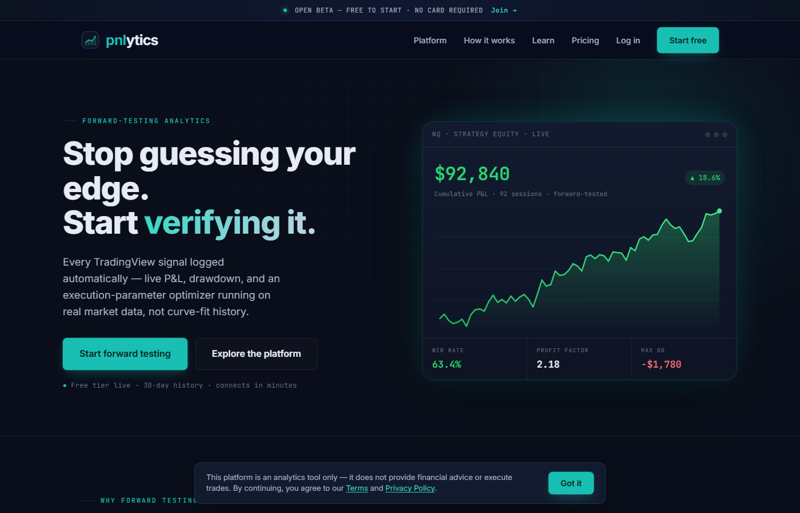

# Shiva Domala — AI-Native Product Portfolio

I spent 19 years in information security & GRC (most recently VP at Wells Fargo; CISSP, CISM, ISO 27001 LI). Since April 2026 I have been building and operating production software by directing AI coding agents — Claude Code for building, with Gemini and Grok as independent adversarial auditors of the same code. I own the product decisions, architecture trade-offs, verification, and security — the agents write the code, and I hold them to evidence.

The product repos below are **private** (commercial / user-data-bearing code). This page is the tour; I'm happy to walk through any codebase, its test suite, or its security-audit history on a call.

📧 sdomalas@gmail.com · [linkedin.com/in/shivadomala](https://linkedin.com/in/shivadomala)

---

## 🟢 Pnlytics — [pnlytics.io](https://pnlytics.io) *(live in production)*

Forward-testing analytics SaaS for futures traders. Ingests TradingView / TradersPost webhook fills in real time and turns them into strategy-level performance analytics.

- **What it does:** walk-forward optimization, Monte Carlo resampling, strategy drift alerts, MAE/MFE trade diagnostics, and slippage reconciliation against actual broker fills — built to solve a real gap: most traders have no honest way to verify that a strategy's live execution matches what its backtest promised.
- **Stack:** FastAPI + Supabase (Postgres), server-rendered UI; I operate the production infrastructure end to end.
- **Security & operations (the part relevant to AI security):** multi-tenant isolation with a read-only shared demo user, webhook authentication, fencing-token distributed locks (lease + generation counter) after a real lock-storm incident, 340+ automated tests, and recurring adversarial security audits with tracked remediation — every audit finding is triaged, fixed, and regression-tested, and I keep the postmortems as engineering records. Two are published here, sanitized:
  - [Database egress storm — a distributed lock without fencing tokens](https://github.com/vasanthaputra/ai-portfolio/blob/main/postmortems/2026-07-database-egress-storm.md)
  - [Supervisor health-check killing live workers](https://github.com/vasanthaputra/ai-portfolio/blob/main/postmortems/2026-07-worker-healthcheck-kills.md)

## 🕉️ Smaran — Sanskrit chant-learning app *(iOS + Android)*

Speech-recognition app that listens while you recite Vedic slokas and follows along in real time, highlighting where you are and where you slipped.

- **Hard problems:** Sanskrit phonology (sandhi, visarga, vowel length) breaks stock speech models; I built a lexicon/threshold system plus a QA audit harness that checks every sloka pack for recognition-failure patterns (false-match runaway, stalls on unrecognized words) before it ships.
- **Privacy:** recognition is fully on-device — no audio leaves the phone.
- **Stack:** SwiftUI (iOS, feature-complete) and a Kotlin/Jetpack Compose Android port.

## ✨ WordGlow — speech practice for neurodivergent kids *(iOS/iPadOS)*

On-device speech-practice app built for my own family: glowing word cards, tap-to-speak, and a research-cited curriculum (5 learning paths, 141 slides) with behavior-specific praise.

- **Voice stack:** parent-recorded audio, Apple Personal Voice, and premium on-device TTS — so the app can speak in a parent's voice.
- **Privacy by design:** everything runs on-device using Apple's Speech framework; no accounts, no telemetry, no cloud.

---

## Related public work

- [renko-strategy-optimizer](https://github.com/vasanthaputra/renko-strategy-optimizer) — quantitative strategy backtester & optimizer for Renko charts on NQ/MNQ futures: Bayesian optimization, regime detection, TradingView CDP bridge.

## Why this matters for AI security

Building these taught me AI risk from the builder's side: prompt-injection surface in agent workflows, secrets hygiene when an agent has shell access, verifying AI-written code you didn't type, and running security audits against your own production stack. Combined with two decades of enterprise GRC — including helping stand up GenAI use-case intake and risk review at a systemically important US bank — my lane is making AI security governance technically honest.
